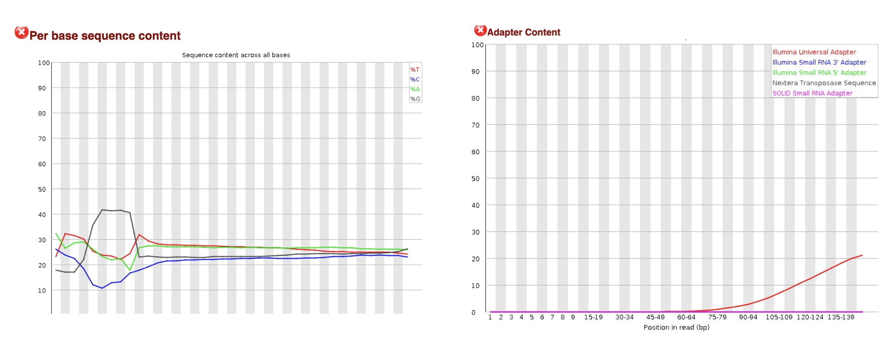
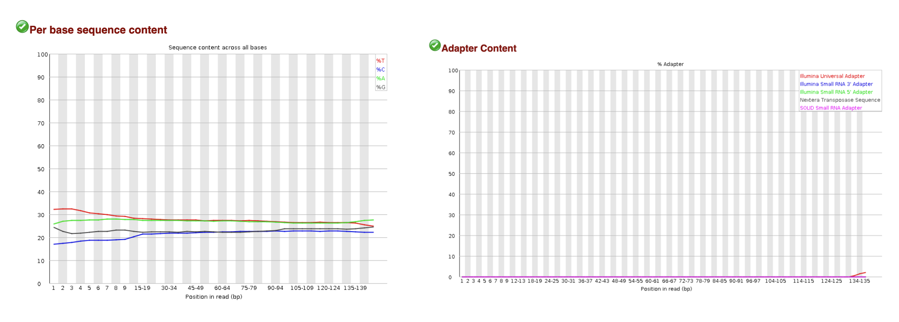
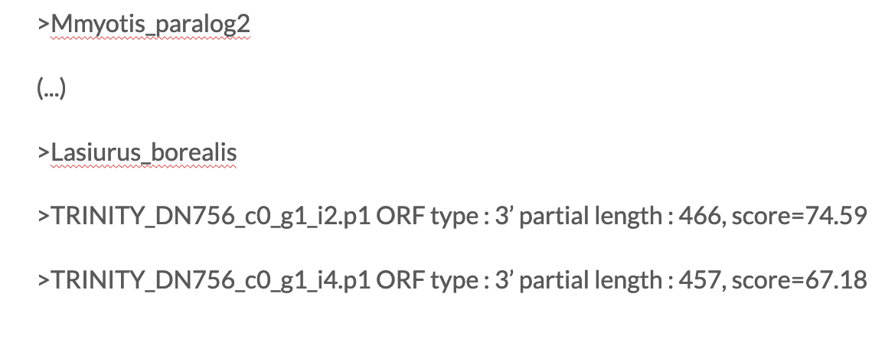
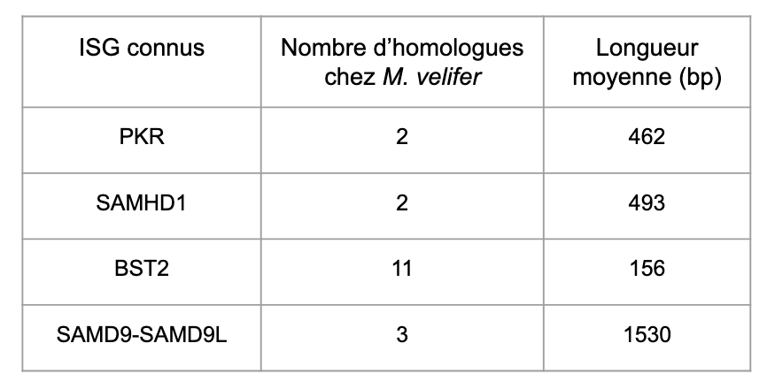
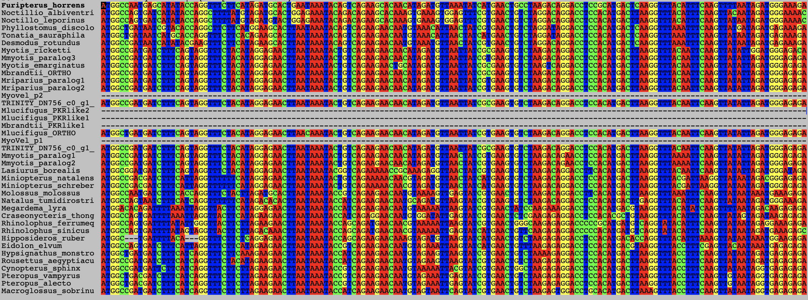
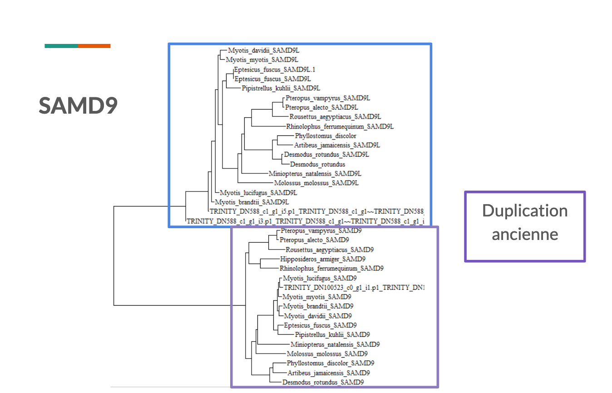
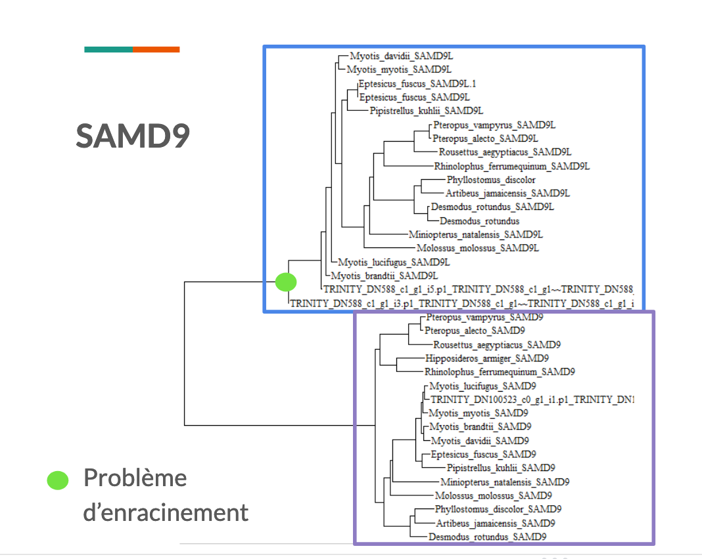
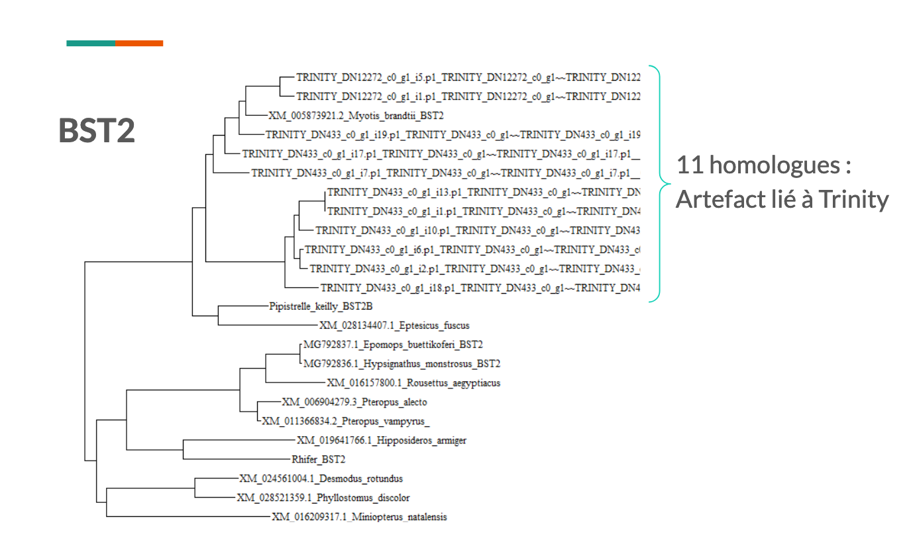

# TP NGS bats

readme du projet NGS

# Objectif du TP 
L'etude des chauves souris a montre qu'elles sont très sujettes à des infections virales mais sont la plupart du temps assymptomatiques. On veut donc en observant leur système immunitaire, essayer de comprendre ce qui les rend si particulières. On utilise des donnees de RNAseq de fibroblastes de Myotis Velifer. Dans un premier temps, on va analyser les donnees, et les nettoyer pour faciliter le travail ultérieur. Puis on assemblera les reads pour ensuite realiser une analyse phylogenetique. Un second groupe se concentre sur les analyses transcriptomiques. 

Le readme est organise par section avec a chaque fois le principe de la section + le nom du programme que nous avons ecrit afin de realiser ce principe.

# Lancer un programme
ls -l (voir les droits que l'on a sur le programme)
chmod u+x (ajouter le droit de l'executer)
./program.sh (lancer simple)
nohup ./program.sh >& path/nohupprogram.text & (lancer en arriere plan avec les commandes qui s'inscrivent dans le fichier text)

htop (afficher les programmes en cours)
ps (idem mais mieux)
kill identifiant (termine le programme vise)

# Telechargement de donnees de sequencage : downloaddonnees.sh
Telecharge les donnees dans 1 fichier "donnees", il faut se connecter avec le username et le password connu

# Controle qualite : programfastqc.sh
Les fichiers rendus par fastqc sont dans un dossier fastqc_data. Il faut regarder les fichier en .html. Rapport sous forme graphique de chaque reads. Très intuitif à comprendre pour chaque graphique. On montre ici 2 donnees d'analyse : la proportion relative de chaque base et le contenu en adaptateur. On voit que on a une plus forte proportion de G que des autres bases vers le debut de la sequence. On observe aussi la presence de l'adaptateur qui a servi au sequencage vers la fin du read. D'autres parametres sont aussi à corriger (qualite de la sequence au debut du read, etc). 

On peut donc utiliser un programme de nettoyage pour obtenir des donnees plus belles. 

# Nettoyage des sequences : programtrimmomatic.sh
Les donnees seront dans trimm_data.
Parametres : Illuminaclip:path/adapt.fasta:2:30:10 Headcrop:9 Minlen: 100 Trailing: 26
Le fichier adapt.fasta donne les sequences des adapteurs utilises qui sont a enlever du read, 2:30:10 30 et 10 sont des parametres de qualite, 2 autorise des appariements imparfait avec la sequence de l'adaptateur. 
Headcrop=9, on coupe les 9 premieres bases de chaque sequence, --> on a un hexamer au debut du read qui provient de la technique de manipulation
Minlen=100, on elimine les reads plus petites que 100pdb.
Trailing 26, on elimine les fragments dont le score de qualite est inf a 26. 

# On rerun programfastqc.sh pour evaluer l'effet de trimmomatic

Les problemes observes avant sont resolus, on peut continuer l'analyse. 

# Assemblage des sequencages : programtrinity.sh
Trinity est un ensemble de 3 programmes qui fonctionnent à la suite et rendent les donnees assemblees (Inchworm, Chrysalis et Butterfly). Trinity est robuste et precis, il travaille les donnees jusqu'a la moelle. 
Paramètres : --seqType fq --max_memory 14G --left liste1  --right liste2 --CPU 4 --SS_lib_type RF --output path/dossier
Attention liste1 et 2 doivent etre une suite de nom uniquement separes par des virgules ! Ce sont les fichiers avec les read dans 1 sens et dans l'autre. Le dossier de sortie est trinity_data

On obtient en sortie 404732 transcripts. C'est assez consequent, tous ne doivent pas etre des sequences codantes d'interet. 

# Detection des ORFs dans l'assemblage : programtransdecodeur.sh
Transdecodeur permet de detecter les ORFs dans les transcripts retournes par trinity. Il fonctionne en 2 temps : extraction des long ORFs puis selection du meilleur candidat a chaque fois. 
Parametres : 
LongOrfs : -t path/fichier.fasta --gene_trans_map path/fichier.fasta.gene_trans_map -S -O path/dossier
Predict : -t path/fichier.fasta --single_best_only  -O path/dossier
Sortie des fichiers dans transdec_data. Trans_map permet d'identifier les sequences. Peut tourner en nohup car assez long. 

On obtient 61014 sequences codantes. (commande de comptage : grep ">" -c path/fichier.fasta.transdecoder.cds)

# Creation d'une banque blast, blast avec la banque et filtrage des donnees : programblast.sh nomdugene
Program cplxe avec plusieurs if --> ne creer le fichier d'analyse que si il n'existe pas, ou qu'il est vide etc ou que si le gène donné existe bien. Beaucoup de lignes et de fonctions sont expliquees au sein du programme. 
Attention ce programme fonctionne avec un argument d'entree : le nom du gene sur lequel on souhaite travailler
Dossier de sortie : blastdb pour makeblastdb, homologue pour blastn et blastdbcmd.
Parametres : makeblastdb -in path/fichier.fasta.transdecoder.cds -dbtype nucl -parse_seqids -out path/dossier
  --> on blast en nucleotides, parseseqid necessaire car on est format fasta.
blastn -db path/dossier -query path/fichier.fas -evalue 1e-20 -outfmt 6 -out path/dossier
  --> valeur de evalue à decider, format de sortie 6 est tabulaire
blastdbcmd -entry path/fichier -db path/dossier -out tmp.fasta
Les fichiers de sorties sont composes d'une liste de sequence avec d'abbord les sequences d'autres chauve souris puis les reads trinity : 

Comparatif de ce que nous rend le blast pour quelques genes d'interet maximal.
{width=50%}

# Alignement multi sequences : programprank.sh
Prank aligne les donnees obtenues suite au blast et nous permet ensuite d'inferer des relations phylogenetiques en distinguant les evenements d'insertions/deletions. 

Attention ce programme fonctionne avec un argument d'entree : le nom du gene sur lequel on souhaite travailler (fichier initial) et le fasta file qui contient la sortie de blast (format nomdugene+Myovelxxx). 

Parametres : -gapext=0.5 -gaprate=0.005 -d=fastafile +F -o=nomdugene_alnF
F : gestion des gaps, apres une insertion il cherche pas a aligner aussi strictement, gaprate = probabilite d'ouverture des gaps; gapext = probabilite d'extension des gaps

Le programme utilise trimal en toute fin pour retourner des fichier en format phylip qui est le format requis pour l'utilisation de Phyml. 
On peut visualiser l'alignement obtenu par Prank grace au logiciel Seaview sur nos ordinateurs personnels. 

{width=20%}

# Analyse phylogenetique et design des arbres : programphyml.sh

Attention ce programme fonctionne avec un argument d'entree : le nom du gene sur lequel on souhaite travailler

Parametres : -i file_name"_aln.best.phyX" -d nt -m HKY85 -a e -c 4 -s NNI -b -1
-i : Sequences alignees au format phylip (trimAl), -d : Nucleotides -m : Choix d'un modele de substitution -a : Estimation du maximum de vraisemblance -s : Modele pour la construction de l’arbre, ici nearest-neighbor interchange (NNI), -b :  Test statistique pour les branches, ici -1 indique approximate likelihood-ratio test (aLRT)

{width=50%}
{width=50%}
{width=50%}

Pour SAMD9, on observe deux moities d'arbres bien symetriques avec les especes qui se repetent de chaque cote. Cela est caracteristique d'un evenement de duplication precedant la speciation des differentes chauves souris. Cependant, l'ancrage n'est pas bon au niveau de l'arbre superieur. En effet, on arrive en plein millieu du groupe des Myotis. Cela peut provenir d'une attraction des longues branches qu'il faudrait corriger. 
BST2 montre 11 contigs trinity alors que aucune autre espece ne possede autant de copies du gene. On peut supposer qu'il y a une erreur dans l'assemblage des reads avec une surrepresentation de BST2. Pour contrer cela, on pourrait travailler avec des donnees de sequancages issus du genome et non du transcriptome. 

# Conclusion : 
L'analyse realisee ici pendant le TP semble indique des evenements phylogentiques de duplication plus ou moins specifiques de Myotis velifer. On a donc un evenement recent de duplication pour EIF2AK2. On  a pu aussi identifier des homologues aux ISG connus precedement chez d'autres chauves souris/espèces de primates. Cela ouvre donc des pistes à creuser pour des etudes ulterieures avec notamment quelques biais experiemntaux que l'ont pourrait corriger en croisant avec de nouvelles donnees de genomique et aussi en affinant les analyses pour eviter des biais d'analyse phylogenetiques. 

